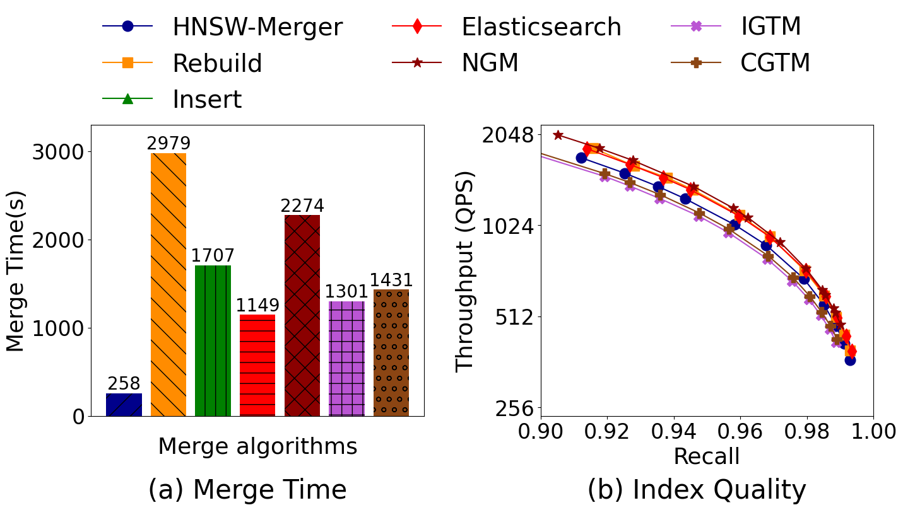
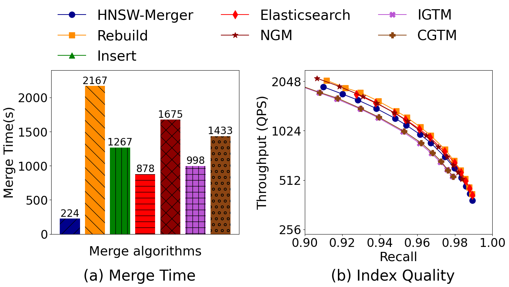
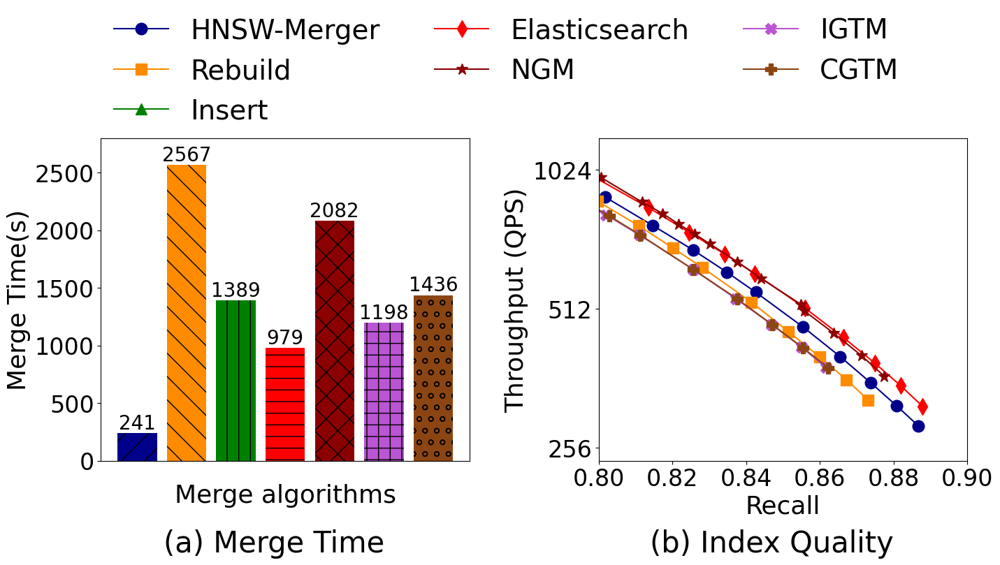
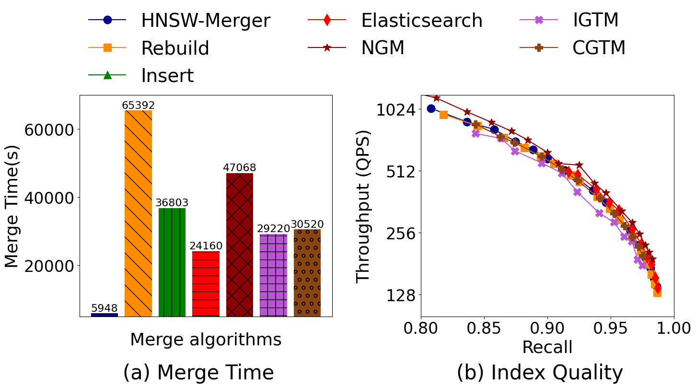
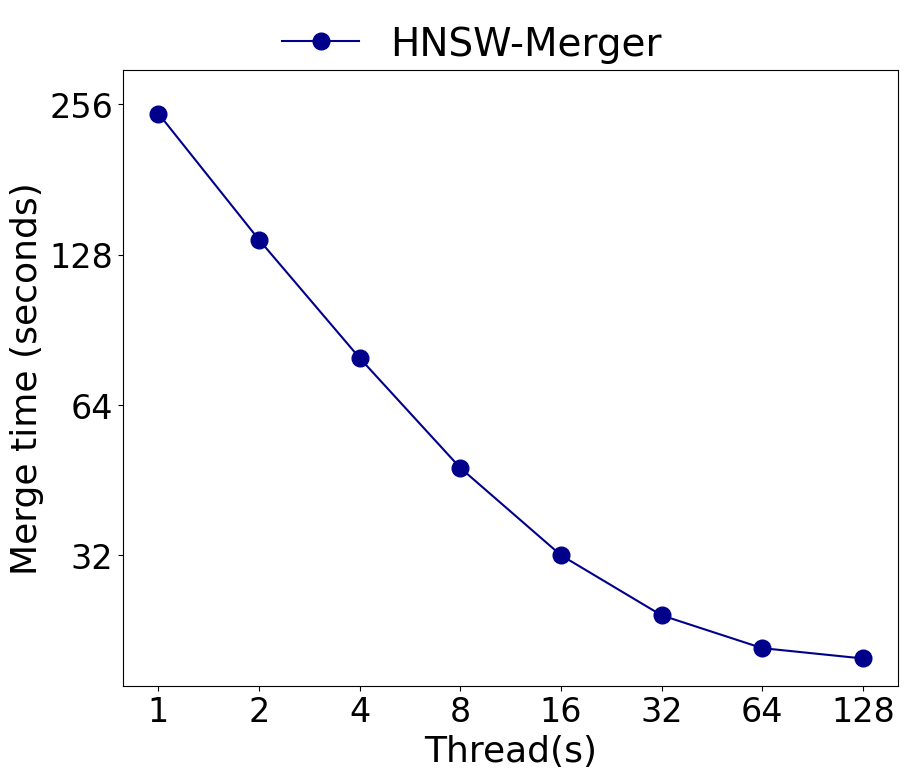
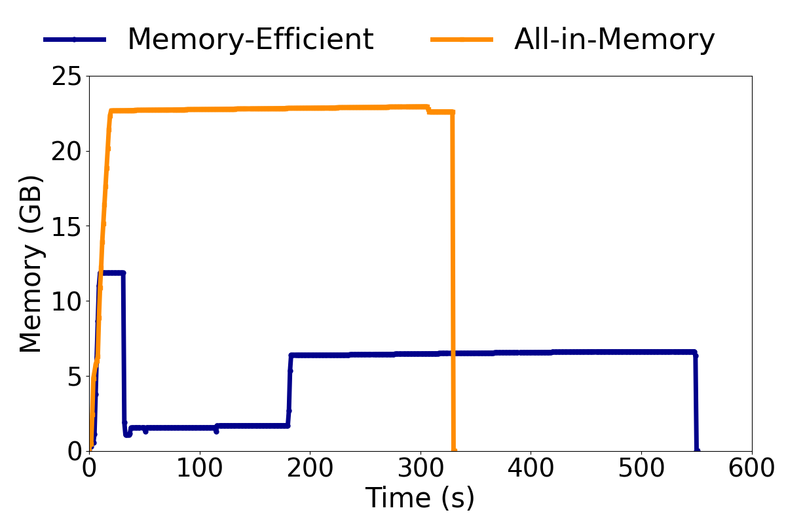
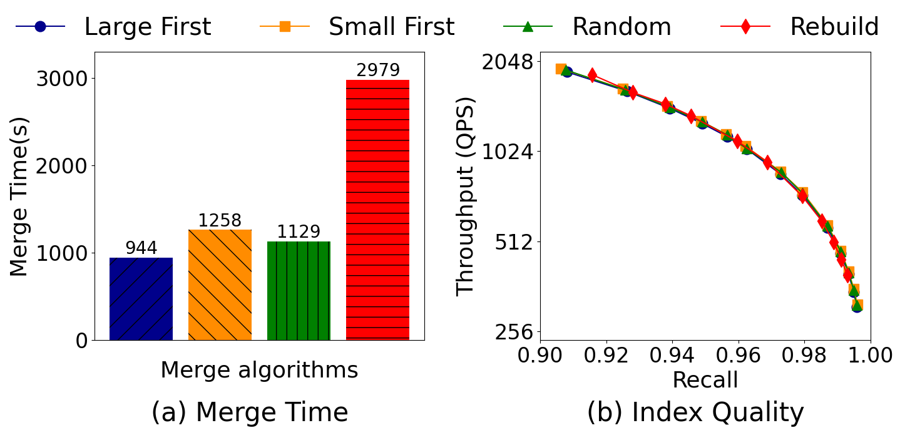
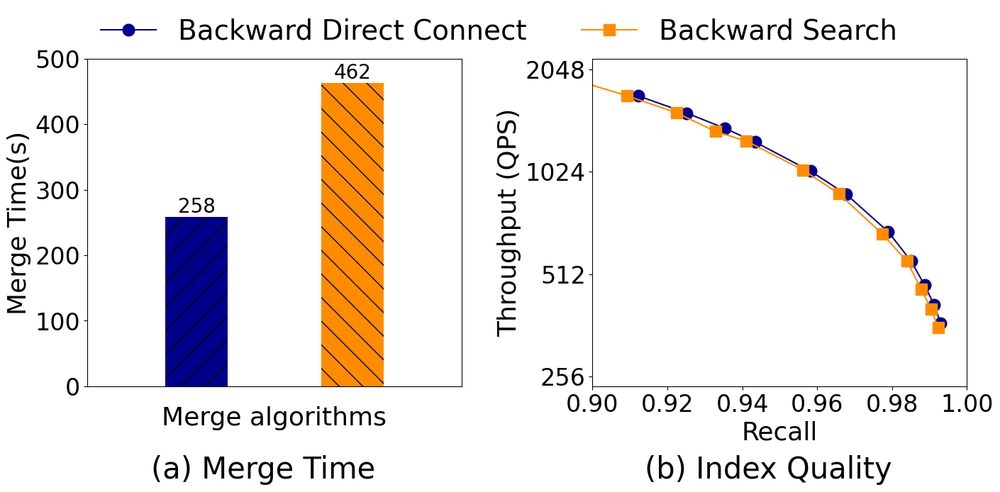
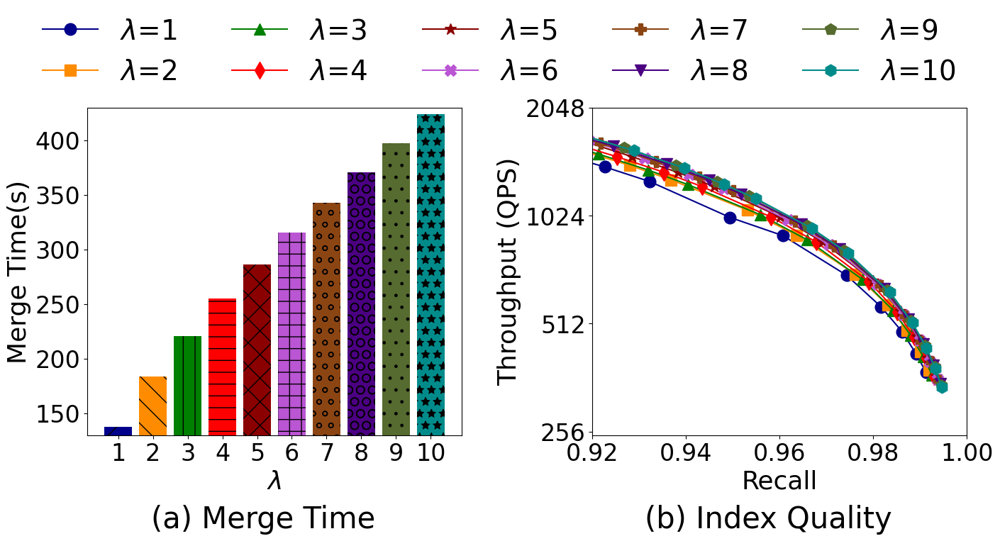

# HNSW-Merger: An Efficient HNSW Index Merging in Vector Databases

This codebase is modified based on the [hnswlib](https://github.com/nmslib/hnswlib) library, and add multiple functions to merge HNSW indexes based on our algorithm or other baselines.

<!-- TOC -->

## 0. Basic Information

### 0.1 Baselines

- rebuild approach
- insert-based approach
- Elasticsearch approach: reimplemented from [JLucene](/lucene/lucene/core/src/java/org/apache/lucene/util/hnsw) and Elasticsearch [post](https://www.elastic.co/search-labs/blog/hnsw-graphs-speed-up-merging)
- NGM: reimplemented from [codebase](https://github.com/aponom84/merging-navigable-graphs) and [paper](https://arxiv.org/abs/2505.16064)
- IGTM: same with NGM
- CGTM: same with NGM

### 0.2 repository structure

Our change compared to the original [hnswlib](https://github.com/nmslib/hnswlib) library is mainly in the folder `./HNSW-Merger`. Now we explain every updates in that folder:

```
./
├── baseline2.h               // reimplementation of NGM, IGTM and CGTM
├── baseline.h                // reimplementation of Elasticsearch approach
├── bruteforce.h  
├── build_index.cpp           // script for index construction
├── experiment.cpp            // script for index merge experiments
├── extension.h               // implementation of our algorithm
├── hnswalg.h
├── hnswlib.h                 // simple modification for merge strategy
├── Makefile                  // script of compiling execution program
├── memory-optimize.h         // implementation of our memory-efficient design
├── run_and_log_mem.sh        // script of memory comsumption monitor
├── space_ip.h
├── space_l2.h
├── stop_condition.h
├── test_config.h             // experiment shell design and decode
├── test_readfile.h           // fvecs/ivecs/bvecs file read
└── visited_list_pool.h
```

To be noticed, our beam search function in `extension.h` is used for Elasticsearch, IGTM and CGTM. 

### 0.3 Specific in Beam Search

As we know, beam search can get a better index quality (on the same query per second level, index built by beam search can return more accurate results than the index built by the point search, which the original hnswlib implements), but a bad search cost because of too many candidates during search. 

Our design as well as To make a fair comparison under the hnswlib framework, we limit the performance of beam search used in the merge algorithms. 
We first choose the `lowerBound` to be the bandWidth-th nearest distance of the top distance, but still choose  `efc` neighbors during search operation in insert operation. This achieves a great balance between the lots of candidates during beam search and its high beam search latency. We validate our design to match the feature of Elasticsearch's [post](https://www.elastic.co/search-labs/blog/hnsw-graphs-speed-up-merging#experiment-1:-int8-quantization).

The Elasticsearch approach with our beam search compared with the original hnswlib insert approach can match the experiment in the Elasticsearch's post. Their results are: compared to the insert-based approach (baseline), merge has a 1.72x speed up but has a compariable index quality. Our experiment in SIFT10M and DEEP10M fit this result. (Turing is a specific case and all the merge algorithms have a better index quality than rebuild/insert approach.)

## 1. Experiment Setup

All of the following steps should be processed in the folder `./HNSW-Merger`. In other word, after entering the repository folder, you need to first:

```
cd HNSW-Merger
```

### 1.1 Download datasets

We support running any dataset with a readable file type by `test_readfile.h`, and the dataset configuration should be added into `test_config.h` before any dataset except `SIFT`, `DEEP` and `TURING` are waiting for experiments.

You can download dataset from the following link: [SIFT](http://corpus-texmex.irisa.fr/), [DEEP](https://github.com/matsui528/deep1b_gt/tree/master), [TURING](https://github.com/harsha-simhadri/big-ann-benchmarks/tree/main/neurips23)

### 1.2 Build indexes

You can use the script we provide to directly build index. The script is like:

```
dim             = [dimention of dataset]
max_elements    = [maximum number of points in the index]
nb              = [number of points in the dataset]
M               = [index configuration]
ef_construction = [index configuration]
lrange          = [left range of point id you want to insert into index from dataset]
rrange          = [right range of point id you want to insert into index from dataset]

base_filepath   = [dataset file path]
index_path      = [index save file path]
```

Run the following command to build index based on the dataset and script you prepared:

```
export OMP_NUM_THREADS = [number of thread you limit, optional]
make build
./builds [your build script path]
```

### 1.3 Merge indexes

You can use the script we provide to directly merge tow or multiple indexes. The script is like:

```
workload_type         = [workload type you can find in test_config.h]
merge_method          = [merge method type you can find in test_config.h]
multi_test_method     = [only for multiple index merge experiment, merge type]
dim                   = [dimention of dataset for the index]
max_elements          = [maximum number of points in the index]
nb                    = [number of points in the dataset]
M                     = [index configuration]
ef_construction       = [index configuration]
k                     = [top-k result we test in the experiment]
kk                    = [top-kk result list in the groundtruth file]
nq                    = [number of query in query file]
iterations            = [number of iterations we test the merge operation]
lrange                = [only for insert merge experiment, left range of inserted point id]
rrange                = [only for insert merge experiment, right range of inserted point id]
rerun                 = [true for rerun the merge operation, false for load the saved index for query test]
thread                = [only for rebuild or insert merge experiment, number of threads we use]
lambda                = [only for HNSW-Merger]
save_index            = [true for save index to indicated path]

base_filepath         = [dataset file path]
query_filepath        = [query set file path]
groundtruth_filepath  = [ground truth set file path]
index_path            = [all index paths that need to be merged, separated by commas]
save_path             = [the saved folder for merged index]
efs_array             = [for query test, all tested efs during search, separated by commas]
```

For the first three parameters, you can find the enumerated type in `test_config.h`, which is also editable.

Not all the configuration parameters are required for every type of experiments. For example, for some experiments like `TWO_WAY_MERGE`, we do not need to set the `multi_test_method`, and you can left it blank in the script.

Run the following command to merge indexes based on the script you prepared:

```
export OMP_NUM_THREADS = [number of thread you limit, optional]
make exp
./exps [your build script path]
```

## 2. Experiment Overview

### 2.1 Comparison between different merge algorithms on different datasets

Summary: As for all the experiments, our HNSW-Merger algorithm outperforms all the baselines in terms of merge speed, and achieve compariable index quality with the best baseline in each experiment. 

#### SIFT10M



#### DEEP10M



#### TURING10M



#### SIFT100M



### 2.2 Different design choice comparison

#### Parallelism Design



#### Memory-Efficient Design



#### Multiple Index Merge Srategies



#### Backward Direct Connect vs Backward Search



#### Different $\lambda$

